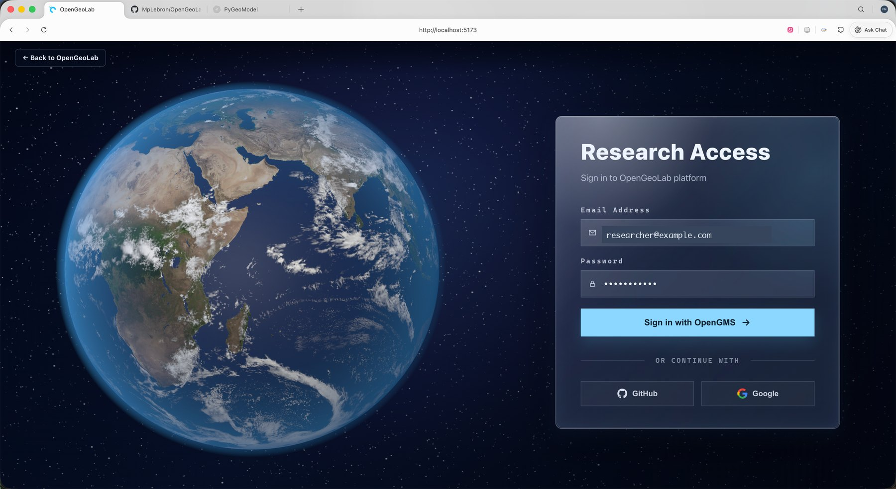
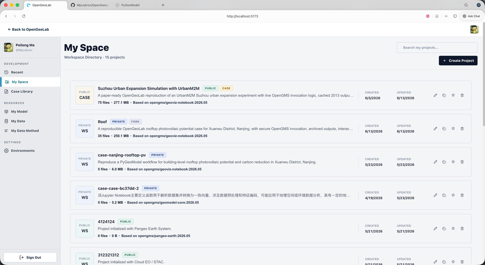
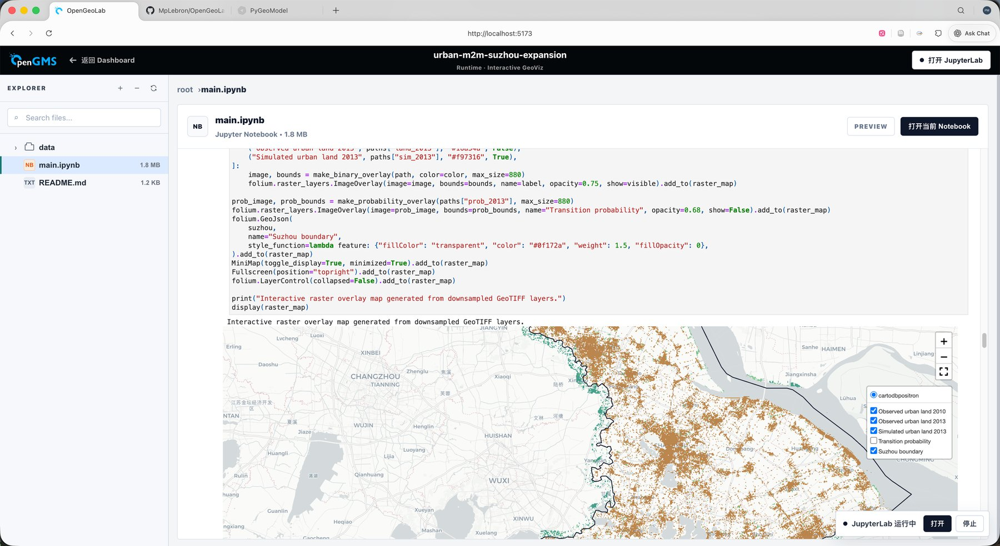

# OpenGeoLab

OpenGeoLab is a Jupyter-centered geospatial modeling workspace for reproducible research. It connects OpenGMS model services, project data, executable notebooks, interactive geovisualization, and an AI-assisted modeling environment in one place.

The project is designed for research systems where a paper, a model service, a dataset, and a runnable experiment should stay close together instead of living in separate tools.

## Project Intent

OpenGeoLab is not only a web portal around JupyterLab. Its goal is to make geospatial modeling experiments easier to publish, inspect, and rerun:

- researchers can enter through a unified research access page;
- projects and case studies are managed as reusable workspaces;
- each case keeps data, model invocation parameters, notebook outputs, maps, and interpretation in one executable record;
- OpenGMS model calls can be submitted from the notebook while archived/reference outputs keep the published analysis reproducible.

### Research Access

The platform starts from a research-oriented login flow, so OpenGMS accounts and project workspaces can be linked before model execution.



### Workspace Directory

Researchers can manage paper-ready cases, private workspaces, runtime environments, and reusable project assets from My Space.



### Executable Case Notebook

A case opens as an executable notebook workspace. The notebook preview keeps code, outputs, maps, model parameters, and interpretation visible before opening JupyterLab for further execution.



## Core Capabilities

- OpenGMS model service invocation from Jupyter notebooks.
- Reproducible case workspaces with bundled data, reference outputs, and notebook records.
- Interactive geospatial visualization for raster and vector model results.
- Runtime management for Docker-based Jupyter environments.
- Project data management for reusable research assets.
- AI-assisted modeling support through the companion agent service and JupyterLab extension.

## Repository Layout

```text
OpenGMS-Jupyter/
├── GeoModelWeb/           # Web application
│   ├── client/            # Vue 3 frontend
│   └── server/            # Node.js/Express backend and Jupyter runtime orchestration
├── agent-service/         # Python agent service
├── jupyterlab-geomodel/   # JupyterLab extension
├── docs/                  # Project documentation and README media
└── README.md
```

## Quick Start

### 1. Start the backend

```bash
cd GeoModelWeb/server
npm install
npm start
```

### 2. Start the frontend

```bash
cd GeoModelWeb/client
npm install
npm run dev
```

### 3. Start the agent service

```bash
cd agent-service
pip install -e .
python run.py
```

### 4. Install the JupyterLab extension for development

```bash
cd jupyterlab-geomodel
pip install -e .
jupyter labextension develop . --overwrite
```

## Configuration

Copy the relevant `.env.example` files before running the system locally or deploying it on a server. The deployment-oriented notes are maintained in:

- `GeoModelWeb/docs/ENV_CONFIG.md`
- `GeoModelWeb/docs/JUPYTER_SETUP.md`
- `GeoModelWeb/docs/PRODUCTION_DEPLOYMENT.md`

Common environment groups include OpenGMS credentials, Jupyter gateway settings, Docker runtime settings, API base URLs, and optional AI-agent configuration.

The current production deployment is designed for the existing geomodeling gateway path:

```text
https://geomodeling.njnu.edu.cn/OpenGeoLab/
```

Local development still runs without that prefix; the `/OpenGeoLab/` path is applied only by the production Vite build and public Nginx gateway.

## Example Cases

The repository includes case workspaces used to demonstrate the intended research workflow:

- Suzhou urban expansion simulation with the UrbanM2M OpenGMS model.
- Xuanwu District rooftop photovoltaic potential assessment.

Each case is structured as a notebook-first experiment with data inspection, model configuration, output visualization, and result interpretation.

## Technology Stack

- Frontend: Vue 3, Vite
- Backend: Node.js, Express
- Notebook runtime: JupyterLab, Docker
- Geospatial analysis: GeoPandas, Rasterio, Folium, Plotly
- Agent service: Python, FastAPI/LangChain-style tooling
- JupyterLab extension: TypeScript, React

## License

MIT
